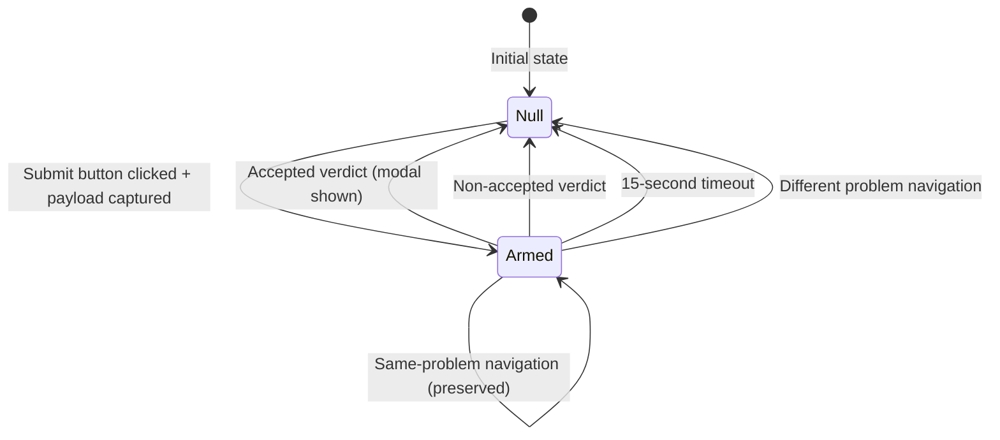

# Design Document: Test Suite Migration to pendingAttempt Object Model

## Overview

This design document specifies the technical approach for migrating the LeetUp test suite from the obsolete `pendingSubmission` boolean model to the current `pendingAttempt` object model. The production code in `content.js` has already been migrated, but 21 tests across 5 test suites still reference the old boolean flag, causing failures.

The migration involves:
1. **State Model Updates**: Replacing boolean references with structured object checks
2. **JSDOM Compatibility Fixes**: Addressing navigation errors in test helpers
3. **Fixture Creation**: Building valid `pendingAttempt` objects with complete payload data
4. **Test Assertion Updates**: Changing all state checks to match the new object model

This is a test-only migration — no production code changes are required.

## Architecture

### Current Production State Model

The production code uses a structured `pendingAttempt` object:

```javascript
let pendingAttempt = {
  payload: {
    problemNumber: "0001",
    problemSlug: "two-sum",
    problemTitle: "Two Sum",
    topicSlug: "array",
    language: "Python3",
    fileExtension: ".py",
    domain: "dsa",
    code: "def twoSum(): pass",
    description: "..."
  },
  startedAt: 1704067200000,  // Date.now() at Submit click
  problemSlug: "two-sum"      // Redundant for same-problem navigation checks
};
```

State transitions:
- **Null**: No pending submission
- **Object**: Submission captured at Submit click, awaiting verdict
- **Cleared to null**: After accepted verdict, non-accepted verdict, 15s timeout, or different-problem navigation

### Obsolete Test Model

Tests currently use a boolean flag:

```javascript
contentModule.pendingSubmission = true;  // Armed
contentModule.pendingSubmission = false; // Disarmed
```

This model is incompatible with production code, which checks `pendingAttempt !== null` and accesses `pendingAttempt.payload`.

## Components and Interfaces

### 1. Test Helper: `mockWindowLocation()`

**Current Implementation** (BROKEN):
```javascript
function mockWindowLocation(locationProps) {
  delete window.location;
  window.location = { href: '...', pathname: '...', ... };  // ❌ Direct assignment fails in JSDOM
}
```

**Issue**: JSDOM throws "Not implemented: navigation" error on direct assignment.

**Fixed Implementation**:
```javascript
function mockWindowLocation(locationProps) {
  Object.defineProperty(window, 'location', {
    writable: true,
    configurable: true,
    value: {
      href: locationProps.href || '',
      pathname: locationProps.pathname || '',
      search: locationProps.search || '',
      hash: '',
      host: 'leetcode.com',
      hostname: 'leetcode.com',
      origin: 'https://leetcode.com',
      port: '',
      protocol: 'https:',
    }
  });
}
```

**Alternative Approach** (for pathname-only changes):
```javascript
window.history.pushState({}, '', newPathname);
```

### 2. Test Helper: `createValidPendingAttempt()`

**Purpose**: Create realistic `pendingAttempt` fixtures for test setup.

**Implementation**:
```javascript
function createValidPendingAttempt(overrides = {}) {
  const defaultPayload = {
    problemNumber: "0001",
    problemSlug: "two-sum",
    problemTitle: "Two Sum",
    topicSlug: "array",
    language: "Python3",
    fileExtension: ".py",
    domain: "dsa",
    code: "def twoSum(nums, target):\n    pass",
    description: "Given an array of integers...",
  };

  const payload = { ...defaultPayload, ...overrides.payload };
  const problemSlug = overrides.problemSlug || payload.problemSlug;

  return {
    payload,
    startedAt: overrides.startedAt || Date.now(),
    problemSlug,
  };
}
```

### 3. Test Helper: `resetDOM()`

**Current**: Resets `pendingSubmission` boolean
**Updated**: Must reset `pendingAttempt` to null

```javascript
function resetDOM() {
  document.body.innerHTML = '';
  contentModule.isModalOpen = false;
  contentModule.pendingAttempt = null;  // ✓ Changed from pendingSubmission = false
}
```

## Data Models

### PendingAttempt Object

```typescript
interface PendingAttempt {
  payload: SubmissionPayload;
  startedAt: number;         // Unix timestamp from Date.now()
  problemSlug: string;       // For same-problem navigation checks
}

interface SubmissionPayload {
  problemNumber: string;     // Zero-padded 4 digits, e.g., "0001"
  problemSlug: string;       // Kebab-case, e.g., "two-sum"
  problemTitle: string;      // Display title
  topicSlug: string;         // Primary tag (may be empty)
  language: string;          // e.g., "Python3"
  fileExtension: string;     // e.g., ".py"
  domain: string;            // "dsa" | "sql-databases" | "shell-scripting"
  code: string;              // Solution code
  description: string;       // Problem description (may be empty)
}
```

### State Transitions



## Migration Strategy by Test Suite

### Suite 1: tests/content.pbt.test.js (2 Property-Based Tests)

**Failing Tests**:
- Property 1: "flow is triggered if and only if trimmed status text is exactly 'Accepted'"
- Property 1: "'Accepted' with surrounding whitespace DOES trigger flow"

**Root Cause**: Property test generators set up DOM but don't arm `pendingAttempt`.

**Migration**:
1. Add `pendingAttempt` fixture creation in property test setup
2. Ensure generators call `createValidPendingAttempt()` before triggering verdict mutations
3. Update property assertions to check `document.getElementById('lgs-modal')` (modal existence validates flow)

**Example Fix**:
```javascript
// BEFORE
beforeEach(() => {
  buildScrapablePage();
  contentModule.pendingSubmission = true;  // ❌ Obsolete
});

// AFTER
beforeEach(() => {
  buildScrapablePage();
  contentModule.pendingAttempt = createValidPendingAttempt();  // ✓ Valid object
});
```

### Suite 2: tests/attachObserver.test.js (4 Unit Tests)

**Failing Tests**:
- "calls injectModal when a new text node with 'Accepted' is added" (line 80)
- "DOES inject modal when 'Accepted' has leading/trailing whitespace" (line 131)
- "does NOT inject a second modal when first mutation already opened modal" (line 217)
- "detects 'Accepted' via characterData mutation" (line 250)

**Root Cause**: All four tests set `pendingSubmission = true` but production checks `pendingAttempt !== null`.

**Migration**:
1. Replace each `contentModule.pendingSubmission = true` with `contentModule.pendingAttempt = createValidPendingAttempt()`
2. Update `resetDOM()` helper to reset `pendingAttempt` instead of `pendingSubmission`
3. No assertion changes needed (tests check modal existence, which is correct)

### Suite 3: tests/premature-modal.test.js (10 Regression Tests)

**Failing Tests**:
- 6 parameterized non-accepted verdict tests (lines 167-175)
- "Delayed container creation: modal fires after container is injected with 'Accepted'" (line 209)
- "Multiple rapid 'Accepted' mutations open exactly one modal" (line 236)
- "Slow submission: container injected long after Submit click still fires modal" (line 272)
- "15-second timeout expiry only disarms pendingSubmission, never opens modal" (line 312)

**Root Cause**:
- Setup: Lines set `pendingSubmission = true` instead of creating `pendingAttempt`
- Assertions: Lines check `expect(contentModule.pendingSubmission).toBe(false)` instead of `expect(contentModule.pendingAttempt).toBe(null)`

**Migration**:
1. **Non-accepted verdict tests**: Change `expect(contentModule.pendingSubmission).toBe(false)` to `expect(contentModule.pendingAttempt).toBe(null)`
2. **Modal injection tests**: Replace `pendingSubmission = true` with `pendingAttempt = createValidPendingAttempt()`
3. **Timeout test**: Change assertion from `pendingSubmission === false` to `pendingAttempt === null`

**Example Fix**:
```javascript
// BEFORE
test.each(NON_ACCEPTED_VERDICTS)('%s verdict clears pendingSubmission', async (verdict) => {
  contentModule.pendingSubmission = true;  // ❌
  // ... trigger verdict mutation
  expect(contentModule.pendingSubmission).toBe(false);  // ❌
});

// AFTER
test.each(NON_ACCEPTED_VERDICTS)('%s verdict clears pendingAttempt', async (verdict) => {
  contentModule.pendingAttempt = createValidPendingAttempt();  // ✓
  // ... trigger verdict mutation
  expect(contentModule.pendingAttempt).toBe(null);  // ✓
});
```

### Suite 4: tests/payload-capture-fix.test.js (2 Payload Tests)

**Failing Tests**:
- "payload is captured via __NEXT_DATA__ JSON"
- "payload is captured at Submit click before route navigation"

**Root Cause**: JSDOM navigation error at `test-helpers.js:18` — `mockWindowLocation()` uses direct `window.location = {...}` assignment.

**Migration**:
1. Fix `mockWindowLocation()` in `test-helpers.js` to use `Object.defineProperty(window, 'location', ...)`
2. No test body changes needed — tests already read `contentModule.pendingAttempt` correctly
3. Verify Submit button click handler creates `pendingAttempt` after navigation fix

### Suite 5: tests/navigation-fix.test.js (6 Navigation Tests)

**Failing Tests**:
- "preserves pendingSubmission when navigating within same problem" (lines 61, 84)
- "clears pendingSubmission when navigating to different problem" (lines 77, 84)
- "clears pendingSubmission when navigating away from problem pages" (lines 93, 100)
- "handles navigation when pendingSubmission is already false" (line 109)
- "handles empty previousUrl gracefully" (lines 125, 131)
- "regression: same-problem navigation fix preserves pending state" (lines 144, 151)

**Root Cause**:
1. **JSDOM navigation errors**: All tests use direct `window.location = { href: '...' }` assignments (lines 61, 77, 93, 109, 125, 144, 151)
2. **Obsolete assertions**: Lines 84, 100, 131 check `pendingSubmission` boolean instead of `pendingAttempt` null check

**Migration**:
1. Replace all `window.location = { href: '...' }` with `mockWindowLocation({ href: '...', pathname: '...' })`
2. Change assertions from `expect(pendingSubmission).toBe(false)` to `expect(pendingAttempt).toBe(null)`
3. Change assertions from `expect(pendingSubmission).toBe(true)` to `expect(pendingAttempt).not.toBe(null)` (if any)
4. Set up initial state with `contentModule.pendingAttempt = createValidPendingAttempt()` instead of `pendingSubmission = true`

**Example Fix**:
```javascript
// BEFORE
test('preserves pendingSubmission when navigating within same problem', () => {
  contentModule.pendingSubmission = true;  // ❌
  window.location = { href: 'https://leetcode.com/problems/two-sum/' };  // ❌ JSDOM error
  // ... trigger navigation
  expect(contentModule.pendingSubmission).toBe(true);  // ❌
});

// AFTER
test('preserves pendingAttempt when navigating within same problem', () => {
  contentModule.pendingAttempt = createValidPendingAttempt({ problemSlug: 'two-sum' });  // ✓
  mockWindowLocation({ 
    href: 'https://leetcode.com/problems/two-sum/', 
    pathname: '/problems/two-sum/' 
  });  // ✓ JSDOM-safe
  // ... trigger navigation
  expect(contentModule.pendingAttempt).not.toBe(null);  // ✓
  expect(contentModule.pendingAttempt.problemSlug).toBe('two-sum');  // ✓ Verify preserved
});
```

## Error Handling

### JSDOM Navigation Errors

**Error Message**:
```
Error: Not implemented: navigation (except hash changes)
at window.location = { ... }
```

**Solution**: Replace all direct `window.location` assignments with:
1. `Object.defineProperty(window, 'location', { writable: true, value: {...} })` for full location mock
2. `window.history.pushState({}, '', newPathname)` for pathname-only changes
3. Use test helper `mockWindowLocation()` for consistency

### Missing Payload Fields

**Issue**: Tests may create incomplete `pendingAttempt` objects missing required payload fields.

**Solution**: Always use `createValidPendingAttempt()` helper, which provides all required fields with valid defaults. Override specific fields only when testing edge cases:

```javascript
// Full fixture
contentModule.pendingAttempt = createValidPendingAttempt();

// Override specific field
contentModule.pendingAttempt = createValidPendingAttempt({
  payload: { problemSlug: 'custom-slug' }
});
```

### Stale Test References

**Issue**: Tests may have lingering references to `pendingSubmission` in comments or variable names.

**Solution**: Global search-and-replace:
- `pendingSubmission` → `pendingAttempt`
- Variable names, comments, test descriptions should all reference the new model

## Testing Strategy

### Unit Test Coverage

All migrated tests maintain the same coverage as before:

1. **Observer Attachment**: Verify `attachObserver()` correctly watches for result container and verdict mutations
2. **Verdict Detection**: Verify "Accepted" triggers modal, non-accepted verdicts clear state
3. **Modal Injection**: Verify modal appears only when `pendingAttempt !== null`
4. **Idempotency**: Verify exactly one modal appears per submission
5. **Navigation**: Verify same-problem navigation preserves state, different-problem clears state
6. **Timeout**: Verify 15-second timeout clears state without opening modal
7. **Payload Capture**: Verify payload is scraped at Submit click, used for modal injection

### Property-Based Test Configuration

**Feature**: test-suite-migration

**Properties**:
- Property 1: For any verdict text that trims to "Accepted", modal appears if and only if `pendingAttempt !== null`
- Property 2: For any non-accepted terminal verdict, modal does NOT appear and `pendingAttempt` is cleared to null

**Configuration**:
- Minimum 100 iterations per property (uses `fc.assert` with default settings)
- Generators produce random verdict strings with varying whitespace
- Setup ensures `pendingAttempt` is armed with valid fixture before each iteration

### Integration Points

**Test Helpers** (`test-helpers.js`):
- `mockWindowLocation(locationProps)` — JSDOM-safe location mocking
- `createValidPendingAttempt(overrides)` — Fixture factory
- `extractProblemSlugTest(url)` — URL parsing (unchanged)

**Content Module Exports** (`content.js`):
- `get pendingAttempt()` — Getter for test inspection
- `set pendingAttempt(v)` — Setter for test setup
- `clearPendingAttempt(reason)` — Exposed for verification in tests

## Verification Plan

### Pre-Migration Baseline

```bash
npm test
```

**Expected Output**:
- 5 test suites failed
- 21 tests failed
- 287 tests passed

### Post-Migration Success Criteria

```bash
npm test
```

**Expected Output**:
- 0 test suites failed
- 0 tests failed
- 308 tests passed

### Detailed Verification Steps

1. **Run full test suite**: `npm test` → All tests pass
2. **Run individual suites**:
   ```bash
   npm test tests/content.pbt.test.js
   npm test tests/attachObserver.test.js
   npm test tests/premature-modal.test.js
   npm test tests/payload-capture-fix.test.js
   npm test tests/navigation-fix.test.js
   ```
3. **Verify coverage maintained**: Check that no tests were deleted (only modified)
4. **Manual smoke test**: Load extension in Chrome, submit a LeetCode problem, verify modal appears
5. **Code review**: Ensure no `pendingSubmission` references remain in test files

## Implementation Checklist

### Phase 1: Test Helpers
- [ ] Fix `mockWindowLocation()` in `test-helpers.js` (use `Object.defineProperty`)
- [ ] Add `createValidPendingAttempt()` helper to `test-helpers.js`
- [ ] Update `resetDOM()` helper in each test file to reset `pendingAttempt`

### Phase 2: Suite 1 (Property-Based Tests)
- [ ] Update `tests/content.pbt.test.js` property test setup to arm `pendingAttempt`
- [ ] Verify generators create valid fixtures before verdict mutations
- [ ] Run suite: `npm test tests/content.pbt.test.js` → 0 failures

### Phase 3: Suite 2 (Observer Unit Tests)
- [ ] Replace `pendingSubmission = true` with `pendingAttempt = createValidPendingAttempt()` (4 tests)
- [ ] Update `resetDOM()` calls
- [ ] Run suite: `npm test tests/attachObserver.test.js` → 0 failures

### Phase 4: Suite 3 (Regression Tests)
- [ ] Update non-accepted verdict test assertions (6 tests)
- [ ] Update modal injection test setup (3 tests)
- [ ] Update timeout test assertion (1 test)
- [ ] Run suite: `npm test tests/premature-modal.test.js` → 0 failures

### Phase 5: Suite 4 (Payload Capture Tests)
- [ ] Verify `mockWindowLocation()` fix resolves JSDOM navigation errors
- [ ] Run suite: `npm test tests/payload-capture-fix.test.js` → 0 failures

### Phase 6: Suite 5 (Navigation Tests)
- [ ] Replace all `window.location = {...}` with `mockWindowLocation()` calls (7 instances)
- [ ] Update all `pendingSubmission` boolean checks to `pendingAttempt` null checks (6 tests)
- [ ] Run suite: `npm test tests/navigation-fix.test.js` → 0 failures

### Phase 7: Final Verification
- [ ] Run full test suite: `npm test` → 308 passing, 0 failing
- [ ] Search codebase for lingering `pendingSubmission` references in test files
- [ ] Review changes for consistency and correctness

## Traceability Matrix

| Requirement ID | Design Component | Test Coverage |
|----------------|------------------|---------------|
| 1.1 - 1.7 | pendingAttempt object structure | All 21 migrated tests |
| 2.1 - 2.7 | Payload capture at Submit click | Suite 4 (2 tests) |
| 3.1 - 3.7 | Verdict detection lifecycle | Suite 2 (4 tests), Suite 3 (6 tests) |
| 4.1 - 4.5 | Same-problem navigation | Suite 5 (6 tests) |
| 5.1 - 5.4 | JSDOM compatibility | All navigation tests (Suite 5) |
| 8.1 - 8.10 | Test file coverage | All 5 suites (21 tests total) |
| 9.1 - 9.5 | Test execution success | npm test exit code 0 |
| 11.1 - 11.4 | Test helper compatibility | mockWindowLocation(), createValidPendingAttempt() |

## Conclusion

This migration updates 21 tests across 5 test suites to align with the production `pendingAttempt` object model. The changes are mechanical and well-scoped:

1. **Replace boolean state** with structured objects
2. **Fix JSDOM navigation** errors in test helpers
3. **Create reusable fixtures** for consistent test setup
4. **Update assertions** to match new state model

No production code changes are required. After migration, the full test suite will pass, validating that the test coverage accurately reflects production behavior.
