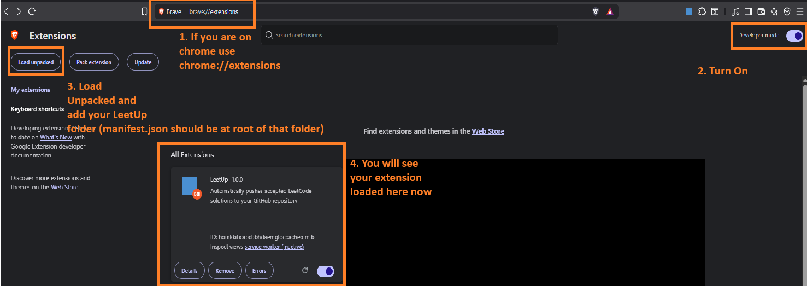
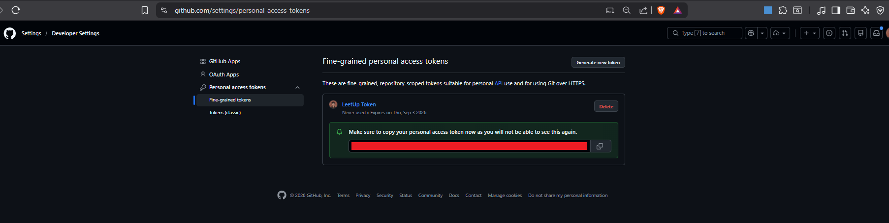
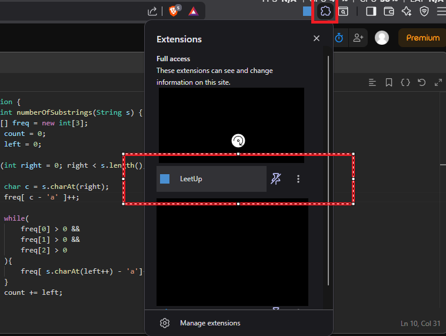
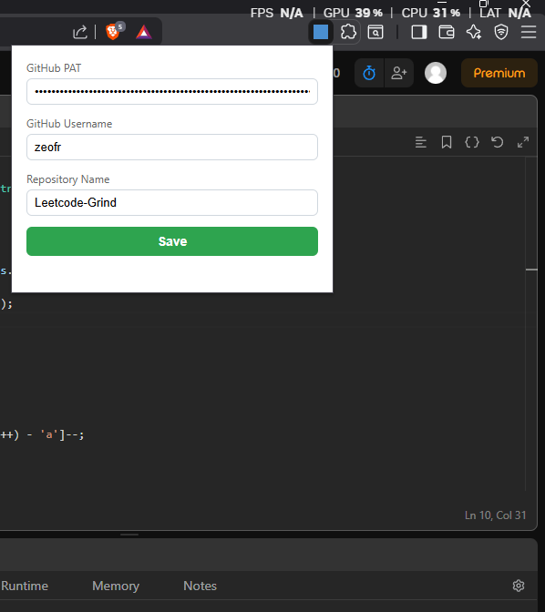
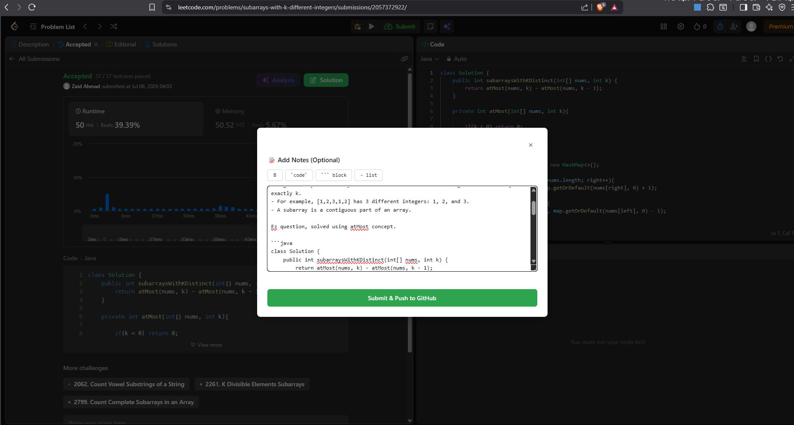

# LeetUp

LeetUp is a small Chrome extension that turns every accepted LeetCode submission into a clean little archive in your GitHub repository. It quietly handles the boring part so you can stay focused on solving.

If you want a personal record of your progress that feels organised without asking you to do extra work, this is for you.

## Contents

- [What LeetUp does](#what-leetup-does)
- [Why it feels useful](#why-it-feels-useful)
- [Quick start](#quick-start)
- [How your repository will look](#how-your-repository-will-look)
- [Security and privacy](#security-and-privacy)
- [For developers](#for-developers)

---

## What LeetUp does

When you solve a problem and LeetCode shows that you were accepted, LeetUp opens a small modal and helps you save the moment in a simple, readable way.

It will:

- capture the problem details and your solution code,
- let you add a few notes about your approach,
- push your solution, a generated README, and the problem statement into your GitHub repository.

No copy-paste. No tab switching. Just solve, confirm, and save.

---

## Why it feels useful

LeetUp is built for people who want to keep a thoughtful archive of their work without making it feel like a chore.

You get:

- a neat record of accepted solutions,
- a simple README for each problem,
- a repository that grows naturally as you practice,
- a calm, lightweight experience that stays out of your way.

---

## Quick start

### 1. Install the extension

Clone or download this project, then load it into Chrome as an unpacked extension.



1. Open Chrome and go to `chrome://extensions`.
2. Turn on Developer mode.
3. Click Load unpacked and select the LeetUp folder.

### 2. Create a GitHub access token

LeetUp uses a GitHub Fine-Grained Personal Access Token to push your work into your repository.

If you need help creating one, GitHub has a straightforward guide here:
https://docs.github.com/en/authentication/keeping-your-account-and-data-secure/creating-a-personal-access-token#creating-a-fine-grained-personal-access-token

For a simpler way, check this out: [Create a fine-grained PAT](https://github.com/settings/personal-access-tokens).
When you create the token, choose the repository(choose a specific repository) you want LeetUp to use, for Example "LeetcodeGrind" repository and grant it "Contents: Read and write access".



### 3. Save your credentials

Open the extension popup and add:

- your GitHub fine-grained PAT,
- your GitHub username,
- the name of the repository you want to use.




### 4. Try it on a real problem

Open any LeetCode problem, solve it, and submit your answer.

When the result says Accepted, LeetUp will appear with a small notes box. Add anything you want to remember(Optional) and click Submit & Push to GitHub.



### 5. See your archive grow

After a successful push, you will find a folder for that problem in your repository with the files LeetUp created.

---

## How your repository will look

Each accepted submission creates a small folder like this:

```text
dsa/
  0001-two-sum/
    solution.py
    README.md
    problem_statement.md
```

The README includes the problem title, your notes, and the problem description when it is available.

---

## Security and privacy

This extension does not use an OAuth popup flow or a third-party auth service to act on your GitHub account. Instead, it uses a fine-grained personal access token that you provide yourself and stores it locally in Chrome.

That means:

- there is no browser-based OAuth redirect or delegated login flow,
- the extension is not asking GitHub to grant broad access on your behalf,
- your token is kept in the browser's local storage area for the extension and is only used for the GitHub API requests that push your saved solutions.

LeetUp is also careful with your credentials:

- your GitHub token is stored locally in Chrome,
- it is only sent to GitHub when a push is made,
- sensitive error messages are cleaned up before they are shown.

---

## For developers

If you want to work on the project locally, the setup is simple:

```bash
npm install
npm test
```

The current test suite covers the core behavior and keeps the extension grounded as it evolves.

---

## License

MIT
