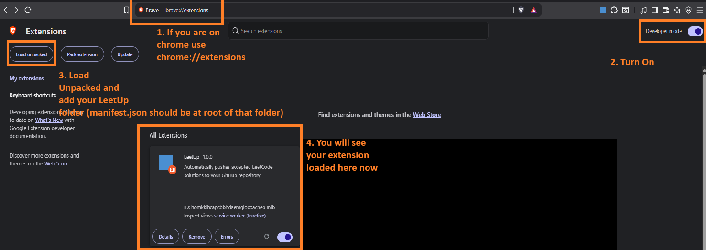
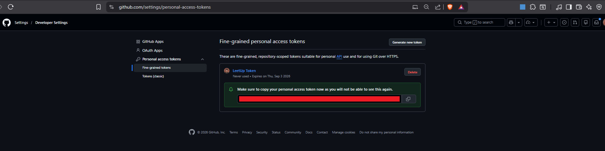
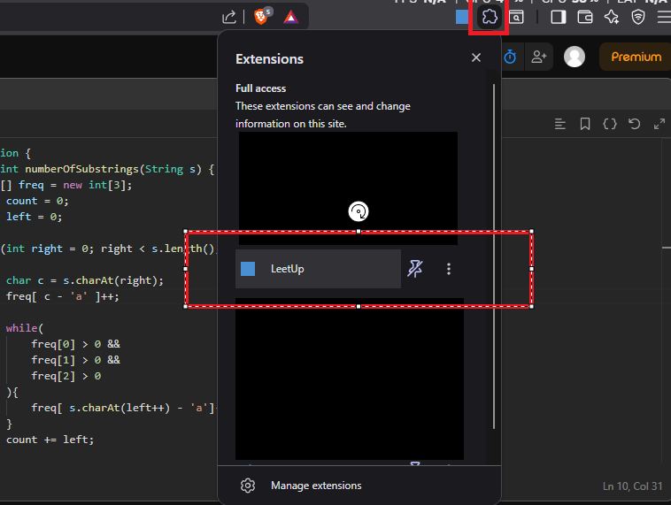
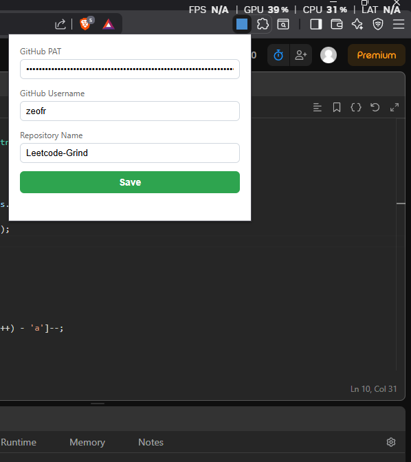
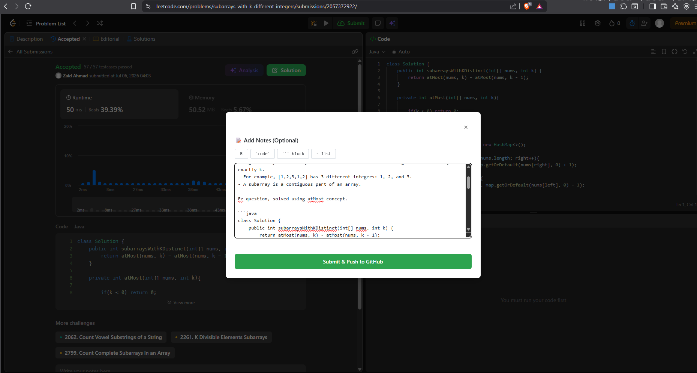

# LeetUp

LeetUp is a small Chrome extension that turns every accepted LeetCode submission into a clean little archive in your GitHub repository. It quietly handles the boring part so you can stay focused on solving.

If you want a personal record of your progress that feels organised without asking you to do extra work, this is for you.

## Contents

- [What LeetUp does](#what-leetup-does)
- [Why it feels useful](#why-it-feels-useful)
- [Quick start](#quick-start)
- [How your repository will look](#how-your-repository-will-look)
- [Security and privacy](#security-and-privacy)
- [For developers](#for-developers)
- [CI/CD](#cicd)

---

## What LeetUp does

When you solve a problem and LeetCode shows that you were accepted, LeetUp opens a small modal and helps you save the moment in a simple, readable way.

It will:

- capture the problem details and your solution code,
- let you add a few notes about your approach,
- push your solution, a generated README, and the problem statement into your GitHub repository.

No copy-paste. No tab switching. Just solve, confirm, and save.

---

## Why it feels useful

LeetUp is built for people who want to keep a thoughtful archive of their work without making it feel like a chore.

You get:

- a neat record of accepted solutions,
- a simple README for each problem,
- a repository that grows naturally as you practice,
- a calm, lightweight experience that stays out of your way.

---

## Quick start

### 1. Install the extension

Clone or download this project, then load it into Chrome as an unpacked extension.



1. Open Chrome and go to `chrome://extensions`.
2. Turn on Developer mode.
3. Click Load unpacked and select the LeetUp folder.

### 2. Create a GitHub access token

LeetUp uses a GitHub Fine-Grained Personal Access Token to push your work into your repository.

If you need help creating one, GitHub has a straightforward guide here:
https://docs.github.com/en/authentication/keeping-your-account-and-data-secure/creating-a-personal-access-token#creating-a-fine-grained-personal-access-token

For a simpler way, check this out: [Create a fine-grained PAT](https://github.com/settings/personal-access-tokens).
When you create the token, choose the repository(choose a specific repository) you want LeetUp to use, for Example "LeetcodeGrind" repository and grant it "Contents: Read and write access".



### 3. Save your credentials

Open the extension popup and add:

- your GitHub fine-grained PAT,
- your GitHub username,
- the name of the repository you want to use.




### 4. Try it on a real problem

Open any LeetCode problem, solve it, and submit your answer.

When the result says Accepted, LeetUp will appear with a small notes box. Add anything you want to remember(Optional) and click Submit & Push to GitHub.



### 5. See your archive grow

After a successful push, you will find a folder for that problem in your repository with the files LeetUp created.

---

## How your repository will look

Each accepted submission creates a small folder like this:

```text
dsa/
  0001-two-sum/
    solution.py
    README.md
    problem_statement.md
```

The README includes the problem title, your notes, and the problem description when it is available.

---

## Security and privacy

This extension does not use an OAuth popup flow or a third-party auth service to act on your GitHub account. Instead, it uses a fine-grained personal access token that you provide yourself and stores it locally in Chrome.

That means:

- there is no browser-based OAuth redirect or delegated login flow,
- the extension is not asking GitHub to grant broad access on your behalf,
- your token is kept in the browser's local storage area for the extension and is only used for the GitHub API requests that push your saved solutions.

LeetUp is also careful with your credentials:

- your GitHub token is stored locally in Chrome,
- it is only sent to GitHub when a push is made,
- sensitive error messages are cleaned up before they are shown.

---

## For developers

If you want to work on the project locally, the setup is simple:

```bash
npm install
npm test
```

The current test suite covers the core behavior and keeps the extension grounded as it evolves.

---

## CI/CD

### What CI checks (runs on every push to `main`, every pull request, and manually)

The pipeline runs three sequential jobs:

**1. validate**
- Verifies `package.json` and `manifest.json` are valid JSON
- Checks all manifest required fields (`manifest_version`, `name`, `version`) are present
- Confirms every file the manifest references on disk exists: `background.js`, `content.js`, `modal.css`, `popup.html`, `popup.js`, `popup.css`, and all three icons
- Checks JavaScript syntax in `content.js`, `background.js`, and `popup.js` using Node's built-in `--check` flag (no ESLint dependency needed)
- Scans the commit range for committed secrets (tokens, keys, PATs) using TruffleHog `--only-verified`

**2. test** (runs only after `validate` passes)
- Installs dependencies reproducibly with `npm ci`
- Runs the full Jest suite (`npm test` → `jest --runInBand`)
- Fails the build on any test failure
- Specifically covers: stale "Accepted" nodes not triggering the modal, unrelated DOM mutations not triggering the modal, non-Accepted verdicts not triggering the modal, genuine accepted submission opening exactly one modal, and GitHub push starting only after the user clicks the modal button

> **Test coverage limitation:** all tests run in jsdom, not a real Chrome runtime. They do not prove compatibility with LeetCode's live production DOM.

**3. package** (runs only after `test` passes)
- Builds a clean `dist/leetup.zip` containing only the ten extension files Chrome needs
- Validates the ZIP: checks manifest is valid inside it, all referenced assets are present, and no forbidden files (tests, `node_modules`, `.env`, `.pem`, `.key`) were accidentally included
- Uploads the ZIP as a workflow artifact (retained 30 days) for manual inspection

**Linting note:** No ESLint configuration exists in this project. Adding a lint ruleset is recommended as a follow-up but was intentionally not added here to avoid a large formatting migration.

---

### What CD does and does not publish

CD is fully manual and release-gated — nothing publishes automatically.

**Triggers:**
- Publishing a GitHub Release (via the GitHub UI or `gh release create`)
- Manual `workflow_dispatch` (useful for dry runs)

**What happens:**
1. All CI checks above are re-run from scratch
2. The verified extension ZIP is built
3. The ZIP is attached to the GitHub Release as a downloadable asset (uses the built-in `GITHUB_TOKEN` — no extra secret required for this step)
4. If Chrome Web Store secrets are configured, the ZIP is uploaded and published to the store; if they are absent, this step prints a notice and exits cleanly

**What CD does NOT do:**
- Does not push to the Chrome Web Store without all four CWS secrets being explicitly set
- Does not run automatically on pushes or merges — only on a deliberately published release or a manual dispatch

---

### Required secrets

Set these in **Settings → Secrets and variables → Actions** on GitHub:

| Secret | Required for | Description |
|---|---|---|
| `CWS_CLIENT_ID` | Chrome Web Store publish | OAuth2 client ID from the Google Cloud Console |
| `CWS_CLIENT_SECRET` | Chrome Web Store publish | OAuth2 client secret |
| `CWS_REFRESH_TOKEN` | Chrome Web Store publish | OAuth2 refresh token (obtained via Google OAuth flow) |
| `CWS_EXTENSION_ID` | Chrome Web Store publish | The extension's ID from the Chrome Web Store URL |

The CI zip-artifact upload and GitHub Release asset upload require no additional secrets beyond the built-in `GITHUB_TOKEN`.

---

### How to trigger a release manually

**Option 1 — GitHub Release (recommended):**
```bash
gh release create v1.2.3 --title "v1.2.3" --notes "Release notes here"
```
This publishes a GitHub Release, which triggers the release workflow automatically.

**Option 2 — Manual workflow dispatch (dry run):**
1. Go to **Actions → Release** in the GitHub UI
2. Click **Run workflow**
3. Leave `dry_run` set to `true` to build and validate only (no release asset upload, no CWS publish)
4. Set `dry_run` to `false` to attach the ZIP to the most recent release and optionally publish to the Chrome Web Store

---

### Node version

Node **20 LTS** is used in all CI/CD jobs. No `engines` field or `.nvmrc` exists in this repository; 20 was chosen because it is the current Active LTS release and matches the local development environment (`v20.12.2`). The version is pinned to the major (`"20"`) so runner patch updates apply automatically.

### Lockfile

`package-lock.json` is tracked in git (a previous `.gitignore` entry that excluded it has been removed). This is required for `npm ci` to produce a deterministic install. Whenever you update dependencies, commit the updated lockfile alongside `package.json`.

---

## License

MIT
